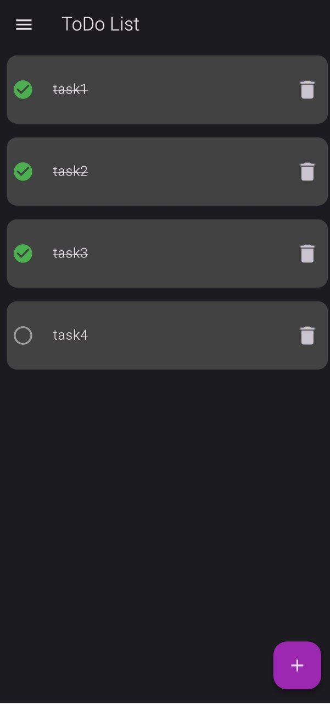
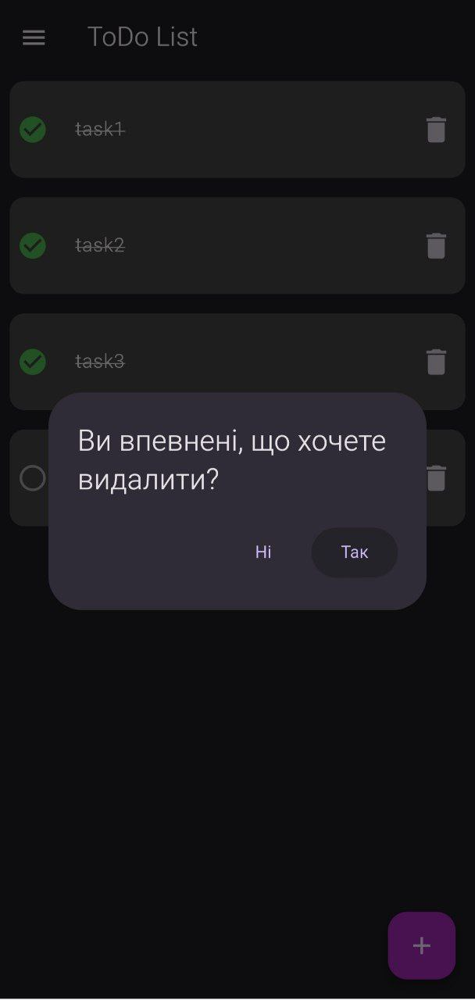
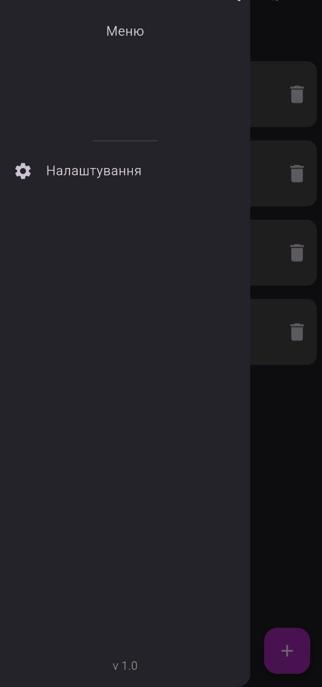

# Проект "Назва твого проекту"

## Українською

### Стек технологій
-  **Flutter**
-  **Dart**
-  **Bloc**  
-  **SQLite**

### Опис проекту
todolist_app - додаток, для списку справ, їх формування та удобного запису, для дальшого виконання і тому інше. Розроблено було мною як пет-проект до портфоліо, проект можна буде скачати у вкладці Releases, та будуть робитись оновлення для додатку.

### Скриншоти

---

## In English

### Tech Stack
-  **Flutter**
-  **Dart**
-  **Bloc**  
  *(Bloc - state management library for Flutter)*
-  **SQLite**

### Project Description
todolist_app - an application for a to-do list, their formation and convenient recording, for further execution and so on. It was developed by me as a pet project for the portfolio, the project can be downloaded in the Releases tab, and updates will be made to the application.
### Screenshots

